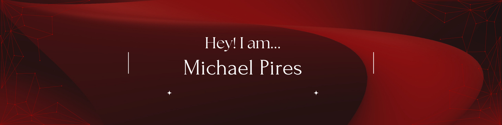
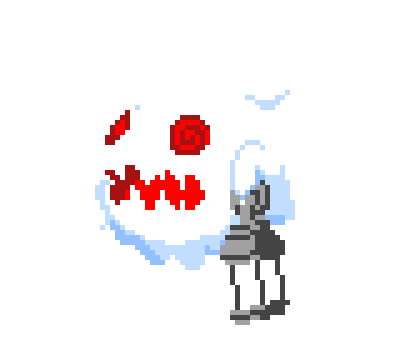

&nbsp;&nbsp;&nbsp;

Eu ❤️ tecnologia.    
Olá! Sou um estudante de Sistemas de Informação na PUC Minas, onde tenho explorado as complexidades e maravilhas deste campo dinâmico em constante evolução. Sou movido pela paixão em aprender, e com ela mantenho minha busca contínua por novos desafios. Com uma mente inquisitiva e ávida por conhecimento, estou pronto para enfrentar os desafios do mundo da tecnologia e crescer profissionalmente.

 
&nbsp;

 

 
 &nbsp;
 &nbsp;

## My Skills

#### Main Stack:

&nbsp;
&nbsp;
&nbsp;
&nbsp;

#### Studying in this moment:

&nbsp;
&nbsp;
&nbsp;

#### Databases:

&nbsp;

#### Workstation Tools:

&nbsp;
&nbsp;
&nbsp;
&nbsp;
&nbsp;

&nbsp;
&nbsp;

## Contacts:

 

 
-----

 Sobre mim:

    Me chamo Michael Pires e sou estudante de Sistemas de Informação na PUC Minas, uma jornada que me levou a explorar profundamente o universo da tecnologia e da programação. 
    Desde 2021, tenho me empenhado na busca por conhecimentos que me levariam a ser um desenvolvedor, uma trajetória que teve início com a familiarização com as linguagens HTML, CSS e JavaScript. 
    Durante minha jornada acadêmica, mergulhei mais fundo no estudo da linguagem C#, o que despertou em mim um entusiasmo genuíno por sua potência e versatilidade.
    Desde pequeno, possuo uma habilidade natural para interagir e me comunicar com as pessoas, uma qualidade que valorizo tanto para minha carreira quanto para minha vida pessoal. 
    Além disso, sou um ávido adepto do desenvolvimento pessoal, sempre buscando oportunidades para aprender e crescer.

-----
  
  

